# ClickHouse & CDC Migration Strategy (Phase 2)

This document establishes the architecture, deployment topology, and migration roadmap for **Phase 2 Analytical Engine (ClickHouse + Change Data Capture via Debezium)** in the CoppAddresd ecosystem.

---

## 1. Overview & Strategic Goals

While **Phase 1 (PostgreSQL Pre-aggregation Rollups)** provides ultra-fast $O(1)$ dashboards for standard metrics, **Phase 2 (ClickHouse OLAP)** introduces true high-performance columnar analytics, enabling:
1. **Ad-hoc Complex Multi-dimensional Slicing**: Filtering by arbitrary patient cohorts, age ranges, biomarkers, clinical diagnoses, and geographical areas over multi-year windows with sub-second response times.
2. **Columnar Compression**: ClickHouse delivers $5\times - 10\times$ data compression compared to row-oriented PostgreSQL storage.
3. **Decoupled Analytical Workloads**: Zero analytical read load on PostgreSQL OLTP databases during heavy executive and AI reporting sessions.

```mermaid
flowchart LR
    subgraph OLTP Tier
        PG[(PostgreSQL 18<br/>Multi-Schema DB)]
        WAL[PostgreSQL WAL<br/>Logical Replication]
        PG --> WAL
    end

    subgraph Event Streaming Tier
        WAL --> Debezium[Debezium CDC Connector]
        Debezium --> Kafka[Kafka / Redpanda Cluster]
    end

    subgraph OLAP Tier
        Kafka --> ClickHouseEngine[ClickHouse Kafka Table Engine]
        ClickHouseEngine --> ReplacingTree[(ClickHouse<br/>ReplacingMergeTree Tables)]
        ReplacingTree --> AggView[Materialized Views<br/>AggregatingMergeTree]
    end

    subgraph Consumption Tier
        AggView --> DotNetAPI[CoppAddresd API<br/>ClickHouse.Client Driver]
        DotNetAPI --> FrontERP[Admin ERP & Dashboards]
    end
```



---

## 2. Infrastructure & CDC Ingestion Architecture

### 2.1. PostgreSQL Logical Replication Setup
PostgreSQL is configured with `wal_level = logical`:
```ini
# postgresql.conf
wal_level = logical
max_replication_slots = 10
max_wal_senders = 10
```

Publication created exclusively for analytical tables:
```sql
CREATE PUBLICATION copp_analytics_pub FOR TABLE 
    app.patient_profiles,
    app.clinical_measurements,
    app.health_test_evaluations,
    app.health_test_results,
    app.program_enrollments,
    app.program_daily_tasks,
    tele.appointments;
```

### 2.2. Debezium Connector Configuration
Debezium captures row-level mutations (INSERT, UPDATE, DELETE) and streams them to Kafka / Redpanda topics formatted as JSON / Avro with before/after payloads.

---

## 3. ClickHouse Table Engines & Schemas

### 3.1. Deduplicated Entity Tables (`ReplacingMergeTree`)
For operational entities that receive updates (e.g. appointments, patient profiles, health test assignments):

```sql
CREATE TABLE default.analytics_appointments (
    id UUID,
    clinic_id UUID,
    patient_id UUID,
    professional_id UUID,
    status LowCardinality(String),
    scheduled_start_time DateTime64(3, 'UTC'),
    scheduled_end_time DateTime64(3, 'UTC'),
    actual_start_time Nullable(DateTime64(3, 'UTC')),
    actual_end_time Nullable(DateTime64(3, 'UTC')),
    cancelled_reason Nullable(String),
    is_telemedicine UInt8,
    created_at DateTime64(3, 'UTC'),
    updated_at DateTime64(3, 'UTC'),
    _version UInt64,
    _is_deleted UInt8
)
ENGINE = ReplacingMergeTree(_version, _is_deleted)
ORDER BY (clinic_id, status, scheduled_start_time, id);
```

### 3.2. Real-Time Rollups (`SummingMergeTree` & `AggregatingMergeTree`)
Pre-calculated materialized views that maintain real-time aggregates as data flows into ClickHouse:

```sql
CREATE MATERIALIZED VIEW default.mv_daily_appointment_stats
ENGINE = SummingMergeTree()
PRIMARY KEY (metric_date, clinic_id, status)
AS SELECT
    toDate(scheduled_start_time) AS metric_date,
    clinic_id,
    status,
    count() AS total_appointments,
    sum(if(actual_start_time IS NOT NULL, 1, 0)) AS completed_count
FROM default.analytics_appointments
WHERE _is_deleted = 0
GROUP BY metric_date, clinic_id, status;
```

---

## 4. Zero-Downtime Cutover & Dual-Read Architecture

To ensure flawless migration from Phase 1 to Phase 2, the backend implements a **Dual-Read Repository Strategy with Feature Flags**:

```csharp
public sealed class ResilientDashboardRepository(
    AppDbContext dbContext,
    IClickHouseConnectionFactory clickHouseFactory,
    IFeatureManager featureManager,
    ILogger<ResilientDashboardRepository> logger) : IDashboardAnalyticsRepository
{
    public async Task<DashboardStatsDto> GetStatsAsync(Guid clinicId, DateRange range, CancellationToken ct)
    {
        if (await featureManager.IsEnabledAsync("UseClickHouseAnalytics"))
        {
            try
            {
                // Primary: ClickHouse High-Performance Columnar Engine
                return await GetStatsFromClickHouseAsync(clinicId, range, ct);
            }
            catch (Exception ex)
            {
                logger.LogWarning(ex, "ClickHouse query failed; falling back to PostgreSQL CQRS rollups.");
            }
        }

        // Secondary / Fallback: PostgreSQL Pre-Aggregated Rollups (Phase 1)
        return await GetStatsFromPostgresRollupAsync(clinicId, range, ct);
    }
}
```

---

## 5. Phased Rollout Milestones

1. **Milestone 1**: Local / Staging deployment of Redpanda and ClickHouse via Docker Compose.
2. **Milestone 2**: Debezium deployment and baseline CDC replication verification.
3. **Milestone 3**: ClickHouse Materialized Views and analytical table creation.
4. **Milestone 4**: .NET Backend `ClickHouse.Client` integration with feature flag routing (`UseClickHouseAnalytics`).
5. **Milestone 5**: 14-day parallel shadow-reading and result parity validation before full production cutover.
