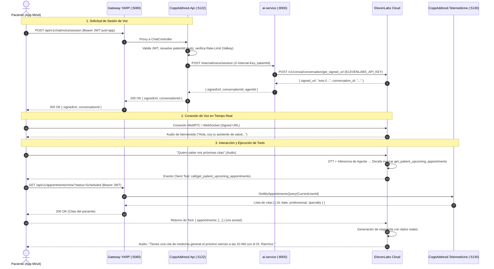

# 03 — Arquitectura Objetivo de Integración con ElevenLabs

> **Documento de Diseño Técnico — Fase 3 del plan `PROMPT_ELEVENLABS.md`**  
> **Fecha:** 2026-09-29  
> **Estado:** Aprobado para diseño (pre-implementación)

---

## 1. Visión y Principios Rectores

El objetivo es integrar **ElevenLabs Conversational AI** como el motor de voz interactivo de alta fidelidad para los pacientes de **CoppAdresd**, garantizando una experiencia natural, empática y de muy baja latencia, respetando estrictamente las políticas de seguridad clínica:

1. **Aislamiento de Secretos:** La `ELEVENLABS_API_KEY` reside exclusivamente en el entorno seguro del servidor (AWS Secrets Manager en producción, `.env` git-ignored en local). Ningún cliente frontend (Ionic, Capacitor, navegador) recibe ni almacena dicha clave.
2. **Identidad Confiable (Anti-IDOR):** La identidad del paciente se deriva de forma estricta del claim `sub` (`ClaimTypes.NameIdentifier`) de su JWT de sesión (`aud=app`). El agente de voz y las herramientas tienen **prohibido** asumir identidades enviadas como texto libre.
3. **Tools de Negocio Específicas:** Prohibición absoluta de herramientas genéricas como `execute_sql` o `query_database`. Cada tool representa un caso de uso asistencial acotado, validado por MediatR y FluentValidation.
4. **Cero Acceso Directo a Base de Datos:** ElevenLabs no se conecta a PostgreSQL ni a RDS; interactúa exclusivamente con APIs controladas que aplican lógica de dominio, control de concurrencia y auditoría.

---

## 2. Decisión Arquitectónica: Comparativa A vs B vs C

Para determinar dónde reside la orquestación de ElevenLabs, se evaluaron tres opciones estructurales:

| Dimensión de Análisis | Opción A: Integrar en Backend .NET (`coppAddresdBack`) | Opción B: Extender `ai-service` Existente (Elegida) | Opción C: Crear un Nuevo Microservicio "Voice AI" |
| :--- | :--- | :--- | :--- |
| **Latencia de Inicio de Sesión** | Muy baja (~200 ms). Comunicación directa .NET → ElevenLabs REST. | Baja (~230 ms). Salto interno adicional en la red local/VPC (.NET → `ai-service` :8000). Imperceptible. | Media-Baja (~240 ms). Salto adicional hacia un nuevo servicio contenedorizado. |
| **Latencia de Conversación (Turn-Taking)** | Idéntica. El audio viaja directo Paciente ⇄ ElevenLabs vía WebRTC. | Idéntica. El audio viaja directo Paciente ⇄ ElevenLabs vía WebRTC. | Idéntica. El audio viaja directo Paciente ⇄ ElevenLabs vía WebRTC. |
| **Seguridad y Gestión de Secretos** | Dispersa la `ELEVENLABS_API_KEY` dentro del monolito .NET, mezclando secretos de IA con reglas de negocio tradicionales. | **Excelente.** Centraliza todas las API keys de proveedores de IA (OpenAI, Anthropic, ElevenLabs) en un único componente cerrado (`ai-service`). | Buena, pero añade una nueva superficie de infraestructura y nuevos endpoints de gestión. |
| **Coste de Infraestructura** | Coste cero incremental (reutiliza los pods ECS actuales de la API). | **Coste cero incremental.** Reutiliza el contenedor ECS existente de `ai-service` que ya corre FastAPI. | **Alto coste innecesario.** Requiere nueva tarea ECS en AWS, Application Load Balancer, logs y pipelines CI/CD. |
| **Observabilidad y Tracing** | Requiere portar trazabilidad de llamadas de IA a C#. | **Óptima.** `ai-service` ya cuenta con `ExecutionTracker`, logging estructurado de agentes y correlation IDs compartidos. | Fragmentada en un tercer repositorio o componente. |
| **Mantenibilidad y Clean Architecture** | Viola el principio de responsabilidad única de la API al mezclar SDKs de audio con el dominio clínico. | **Muy alta.** Respeta el rol de `ai-service` como el cerebro de IA de la plataforma, añadiendo un módulo `app/voice/`. | Aumenta la complejidad operativa del clúster innecesariamente. |
| **Reutilización de Servicios de Negocio** | Directa (en proceso). | **Limpia.** Las tools se ejecutan con el JWT del paciente vía Gateway, reutilizando la API existente sin acoplamiento. | Exige duplicar clientes HTTP o exponer endpoints internos. |

### Veredicto Técnico: **Opción B — Extender `ai-service` existente**

> [!IMPORTANT]
> **Justificación de la Elección:**  
> La **Opción B** es la solución arquitectónicamente más limpia, económica y coherente con el workspace:
> 1. Cumple la directriz mandatoria del proyecto: *"NO crees un microservicio adicional innecesariamente"*. La Opción C queda rotundamente descartada por sobreingeniería y coste operativo redundante.
> 2. `ai-service` ya es el componente oficial de orquestación de inteligencia artificial en CoppAdresd (aloja LangGraph, checkpointer, prompts y adaptadores de LLM). Concentrar la `ELEVENLABS_API_KEY` en su configuración pydantic previene la proliferación desordenada de secretos de IA en el backend principal.
> 3. El backend principal `CoppAddresd.Api` actúa como el **guardián perimetral de identidad y negocio**: valida el JWT del paciente (`aud=app`), aplica rate-limiting y auditoría, y delega a `ai-service` mediante el canal interno autenticado con `X-Internal-Key`.

---

## 3. Flujo de Extremo a Extremo (End-to-End)

El ciclo de interacción se divide en dos fases: **Establecimiento de Sesión Segura** y **Conversación en Tiempo Real con Ejecución de Tools**.

### Diagrama de Secuencia



### Detalle de Pasos Técnicos

1. **Solicitud de Sesión (`antares-paciente` → `CoppAddresd.Api`):**
   - La app invoca `POST /api/v1/chat/voice/session` enviando su token JWT en el encabezado `Authorization: Bearer <token>`.
   - `CoppAddresd.Api` aplica la política `[Authorize(Policy = "AppPatientPolicy")]`, asegurando que `aud == "app"`.
   - Se consulta Valkey (`IDistributedCache`) para validar que el paciente no exceda la cuota de sesiones concurrentes o de frecuencia (evitando consumo desmedido de minutos de ElevenLabs).
2. **Delegación Interna (`CoppAddresd.Api` → `ai-service`):**
   - El backend invoca `POST /internal/voice/session` en `ai-service` inyectando el encabezado secreto `X-Internal-Key` y un payload que incluye el `userId` autenticado y metadatos clínicos básicos para el contexto inicial.
3. **Generación de Signed URL (`ai-service` → ElevenLabs REST API):**
   - `ai-service` invoca el endpoint oficial de ElevenAgents:
     ```http
     GET https://api.us.elevenlabs.io/v1/convai/conversation/get_signed_url?agent_id=agent_4501m3qqzq0ne7qtpcf3p2wkec1a
     Headers:
       xi-api-key: <ELEVENLABS_API_KEY>
     ```
   - ElevenLabs responde con una URL prefirmada de un solo uso con expiración temporal (TTL de 15 minutos).
4. **Streaming de Audio Bidireccional (App ⇄ ElevenLabs):**
   - La app inicializa la conversación conectándose a la URL prefirmada mediante el SDK cliente oficial de ElevenLabs (`@elevenlabs/client`).
   - El intercambio de audio se realiza a través de WebRTC de latencia ultra-baja (o WebSocket seguro con Opus/PCM).
5. **Ejecución de Tools de Negocio mediante Client Tools:**
   - **Mecanismo:** El agente en ElevenLabs está configurado con **Client Tools**. Cuando el LLM decide invocar una tool, ElevenLabs no llama a ningún webhook público; envía un mensaje de llamada de función por el canal de datos WebRTC al cliente.
   - **Seguridad:** El cliente móvil recibe la solicitud de la tool, valida el nombre de la función y la despacha localmente hacia el Gateway (`:5080`) utilizando su propio JWT de sesión.
   - **Anti-IDOR Garantizado:** El paciente nunca envía ni recibe un ID de paciente en el diálogo con ElevenLabs; el backend de telemedicina resuelve las citas a partir del token del usuario que ejecuta la petición HTTP.

---

## 4. Catálogo de Tools de Negocio Específicas

Se definen **6 tools de negocio específicas** alineadas con las capacidades reales existentes en `CoppAddresd.Telemedicine`:

```
┌────────────────────────────────────────────────────────────────────────┐
│                      Tools de Negocio Específicas                      │
├───────────────────────────────────┬────────────────────────────────────┤
│ 1. get_patient_upcoming_appointm. │ 4. reschedule_appointment          │
│ 2. get_available_slots            │ 5. cancel_appointment              │
│ 3. request_appointment           │ 6. get_telemedicine_status         │
└───────────────────────────────────┴────────────────────────────────────┘
```

### 4.1 `get_patient_upcoming_appointments`
- **Propósito:** Permite al paciente consultar por voz sus citas médicas programadas y pendientes.
- **Parámetros de Entrada:** Ninguno. (Se previene IDOR; el paciente se deriva del token de sesión).
- **Servicio Backend Reutilizado:** `CoppAddresd.Telemedicine.Application.Features.Telemedicine.GetMyAppointmentsQuery`.
- **Endpoint Subyacente:** `GET /api/v1/appointments/mine?status=Scheduled`.
- **Payload Devuelto al Agente:**
  ```json
  {
    "appointments": [
      {
        "id": "3fa85f64-5717-4562-b3fc-2c963f66afa6",
        "date": "2026-10-05",
        "time": "10:00",
        "professional_name": "Dr. Carlos Ramírez",
        "specialty": "Medicina General",
        "type": "Telemedicina",
        "can_reschedule": true
      }
    ]
  }
  ```

### 4.2 `get_available_slots`
- **Propósito:** Consultar turnos disponibles para una fecha determinada, opcionalmente filtrados por especialidad o profesional.
- **Parámetros de Entrada:**
  - `date` (string, obligatorio): Fecha en formato `YYYY-MM-DD`.
  - `specialty_id` (string, opcional): UUID de la especialidad deseada.
  - `professional_id` (string, opcional): UUID del profesional específico.
- **Servicio Backend Reutilizado:** `CoppAddresd.Telemedicine.Application.Features.Telemedicine.GetAvailabilitySlotsQuery`.
- **Endpoint Subyacente:** `GET /api/v1/appointments/availability`.
- **Payload Devuelto al Agente:**
  ```json
  {
    "date": "2026-10-06",
    "slots": ["09:00", "09:30", "11:00", "14:30"],
    "total_available": 4
  }
  ```

### 4.3 `request_appointment`
- **Propósito:** Registrar una solicitud formal de cita asistencial cuando el paciente elige un horario.
- **Parámetros de Entrada:**
  - `specialty_id` (string, obligatorio): UUID de la especialidad médica.
  - `preferred_start` (string, obligatorio): Fecha y hora en formato ISO-8601 UTC.
  - `reason` (string, obligatorio): Motivo de la consulta expresado por el paciente.
  - `professional_id` (string, opcional): UUID del médico preferido.
- **Servicio Backend Reutilizado:** `CoppAddresd.Telemedicine.Application.Features.Telemedicine.CreateTelemedicineRequestCommand`.
- **Endpoint Subyacente:** `POST /api/v1/telemedicine/requests`.
- **Regla de Agente:** El agente debe pedir confirmación verbal explícita antes de invocar esta tool: *"¿Confirmas que deseas solicitar la cita con Medicina General para el 6 de octubre a las 9:00 AM?"*.

### 4.4 `reschedule_appointment`
- **Propósito:** Mover una cita existente a una nueva fecha y hora disponible.
- **Parámetros de Entrada:**
  - `appointment_id` (string, obligatorio): UUID de la cita a reprogramar.
  - `new_start` (string, obligatorio): Nueva fecha y hora ISO-8601 UTC.
  - `reason` (string, obligatorio): Motivo del cambio de horario.
- **Servicio Backend Reutilizado:** `CoppAddresd.Telemedicine.Application.Features.Telemedicine.RescheduleAppointmentCommand`.
- **Endpoint Subyacente:** `POST /api/v1/appointments/{id}/reschedule`.
- **Control de Concurrencia:** Respaldado por el índice de exclusión GiST de PostgreSQL (`tstzrange`) para evitar colisiones simultáneas.

### 4.5 `cancel_appointment`
- **Propósito:** Cancelar una cita médica previamente programada.
- **Parámetros de Entrada:**
  - `appointment_id` (string, obligatorio): UUID de la cita a cancelar.
  - `reason` (string, obligatorio): Razón de la cancelación.
- **Servicio Backend Reutilizado:** `CoppAddresd.Telemedicine.Application.Features.Telemedicine.CancelAppointmentCommand`.
- **Endpoint Subyacente:** `POST /api/v1/appointments/{id}/cancel`.
- **Regla de Agente:** Confirmación obligatoria. Si el paciente confirma, se procesa la cancelación y el agente confirma que el cupo ha sido liberado.

### 4.6 `get_telemedicine_status`
- **Propósito:** Conocer el estado de la sala virtual de una cita inminente (si está lista, si el médico ya ingresó, tiempo para inicio).
- **Parámetros de Entrada:**
  - `appointment_id` (string, obligatorio): UUID de la cita de telemedicina.
- **Servicio Backend Reutilizado:** `CoppAddresd.Telemedicine.Application.Features.Telemedicine.GetAppointmentRoomQuery`.
- **Endpoint Subyacente:** `GET /api/v1/telemedicine/appointments/{id}/room`.
- **Payload Devuelto al Agente:**
  ```json
  {
    "room_status": "Ready",
    "doctor_connected": true,
    "can_join": true,
    "message": "El Dr. Ramírez ya se encuentra en la sala virtual esperándote."
  }
  ```

---

## 5. Modelo de Seguridad y Privacidad

1. **Gestión de Credenciales:**
   - La variable `ELEVENLABS_API_KEY` se almacena exclusivamente en **AWS Secrets Manager** (`coppaddresd/elevenlabs/api-key`).
   - La tarea de ECS de `ai-service` recibe la clave mediante secrets injection en la task definition.
   - En desarrollo local reside en `ai-service/.env` (ignorado en `.gitignore`).
2. **Defensa en Profundidad en Tools:**
   - Cada ejecución de tool valida:
     - Que el token Bearer sea válido y no haya expirado.
     - Que el `patientId` de la cita coincida exactamente con el `sub` del token (prevención de IDOR).
     - Que la cita esté en un estado transicionable.
3. **Auditoría y Trazabilidad:**
   - Cada sesión de voz genera un `voiceSessionId` correlacionado que se registra en `audit.activity_logs`.
   - Se registran métricas de inicio de llamada, duración, herramientas invocadas y códigos de respuesta.

---

## 6. Hoja de Ruta para Fases Futuras (Documentación Pendiente)

Las siguientes extensiones se desarrollarán como fases independientes según el plan maestro:

- **Fase 9 — Telefonía Twilio (`docs/elevenlabs/04-twilio-integration.md`):**
  - Adaptar el mismo agente de ElevenLabs para atender llamadas telefónicas tradicionales de entrada y salida mediante Twilio Voice Webhooks.
  - En telefonía no hay una app cliente ejecutando Client Tools; se implementará una capa de **Webhook Tools** protegidas con HMAC y token de sesión temporal.
- **Fase 10 — Privacidad Médica y Zero Retention (`docs/elevenlabs/05-security-privacy.md`):**
  - Configuración formal de la política de **Zero Retention** (`zero_retention_mode: true`) en ElevenLabs.
  - Asegurar que no se persistan grabaciones de audio ni transcripciones completas con PHI en los servidores de ElevenLabs, cumpliendo los estándares de privacidad clínica del proyecto.
