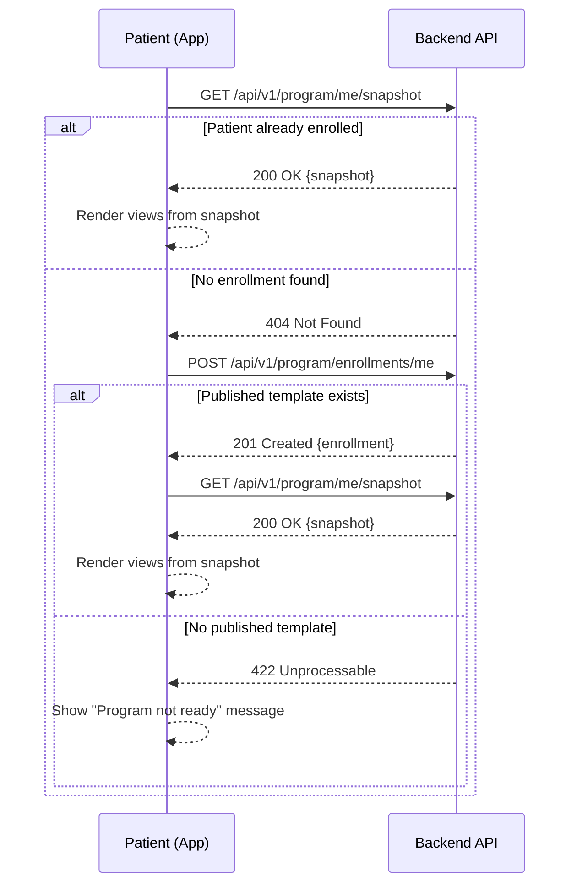

# MOBILE-INTEGRATION — Program Progress Module

> Concrete plan for connecting the `antares-paciente` mobile app to the
> backend program-progress endpoints. Extends [`PLAN.md`](./PLAN.md) (master
> plan) + [`SPEC.md`](./SPEC.md) (contract) + [`TASKS.md`](./TASKS.md)
> (implementation backlog). Task IDs referenced here match TASKS.md.

---

## 1. Current State Summary

| System | Status | Detail |
|--------|--------|--------|
| **Backend (.NET)** | ✅ 100% implemented | 44 REST endpoints in `ProgramController.cs` (998 lines), 22 domain entities, 24 CQRS commands, 18 queries, 12 EF Core migrations. All under `/api/v1/program/*`. |
| **Mobile App UI** | ✅ Complete, mocked | `ProgramPage.tsx` + 3 tabs (Hoy/Racha/Evolución) + 6 interactive lessons. Gamification visuals (confetti, XP popup, Duolingo path, chests) fully operational on local state and hardcoded constants. |
| **ERP (Next.js)** | ✅ Integrated | Already consumes backend via `apiFetch` (`coppaddresd-front/lib/api/http.ts`). Has service layer for enrollments, templates, scores, XP rules, clinical reviews, weaknesses, interventions, content. |
| **Gap** | 🔴 Integration layer | Zero HTTP calls from mobile to program endpoints. No `apiClient.ts`, no TanStack Query, no service layer, minimal TS types. |

### Mobile app files involved

| File | Role | Current data source |
|------|------|---------------------|
| `src/pages/ProgramPage.tsx` | Main page: header + 3-tab segment | `AppContext` (local state) |
| `src/pages/program/TodayView.tsx` | Duolingo-style gamified path | `AppContext.completedSteps` |
| `src/pages/program/StreakView.tsx` | Streak fire + consistency calendar | Mock: `streak=12`, constants |
| `src/pages/program/EvolutionView.tsx` | Health Score + Transformation Score | Mock: `HEALTH_SCORE=86`, `TRANSFORM_SCORE=87` |
| `src/pages/program/Lessons.tsx` | 6 interactive lessons (Podcast, Vitals, Nutrition, Exercise, Nutribiotic, Emotional) | No persistence, UI only |
| `src/data/program.ts` | Mock data master: 700 pts/day, 7 XP levels, 5 health pillars | Static constants |
| `src/context/AppContext.tsx` | Global state: `completedSteps`, `streak`, `xp`, `programWeek` | In-memory, no sync |
| `src/types.ts` | Minimal types: `ProgramTaskId`, `ProgramDay` | — |
| `src/utils/authApi.ts` | Auth only: login, OTP, logout | `fetch` + token in `sessionStorage` |

---

## 2. Architecture Decisions

### §2.1 HTTP Client

Create `antares-paciente/src/utils/apiClient.ts` mirroring the ERP's `apiFetch`
pattern (`coppaddresd-front/lib/api/http.ts`, 398 lines) but adapted for
Capacitor/mobile:

| Aspect | Decision | Rationale |
|--------|----------|-----------|
| Auth | Bearer token from `sessionStorage` | Existing `authApi.ts` stores tokens there. `// TODO: migrate to Capacitor Secure Storage` |
| Refresh | Single-flight refresh on 401 | Same pattern as ERP; avoids concurrent refresh races |
| Timeout | 15s default (vs 30s in ERP) | Mobile networks are more latency-sensitive |
| Errors | `ApiError` class compatible with RFC 7807 | Backend uses ProblemDetails; consistent error shape across projects |
| Credentials | `credentials: 'include'` | Refresh cookie is HttpOnly; sent via Vite proxy in dev |

### §2.2 TanStack Query

Install `@tanstack/react-query` in the mobile app only. Justified divergence
from ERP (which uses custom hooks with `useEffect` + `AbortController`):

| Need | Mobile app | ERP |
|------|-----------|-----|
| Offline cache | Critical (cellular, airplane) | Not needed (admin desktop) |
| Background refetch | Important (streak/XP freshness) | Less important |
| Optimistic mutations | Essential (XP popup, confetti fire before server confirms) | Rare |
| Stale-while-revalidate | Essential (instant UI on tab switch) | Nice-to-have |

Defaults: `staleTime: 5min`, `retry: 2`, `refetchOnWindowFocus: true`.

### §2.3 Enrollment

Auto-enrollment via `POST /api/v1/program/enrollments/me` on first `ProgramPage`
mount. The endpoint is idempotent: if the patient already has an active
enrollment, it returns the existing one.

Flow:
1. `useProgram()` calls `GET /me/snapshot`.
2. If 404 (no enrollment) → trigger `POST /enrollments/me` → refetch snapshot.
3. If still fails (no published template) → show "Your program isn't ready yet.
   Contact your care team."

The patient never sees or interacts with the concept of "enrollment".

### §2.4 Mock Fallback Strategy

All existing mocks in `src/data/program.ts` remain as fallback. Each hook
returns mock data when the query errors:

```typescript
// Pattern used in every hook:
if (query.isError || !query.data) {
  return { data: MOCK_SNAPSHOT, isLoading: false, isError: false }
}
```

Every fallback is marked with `// TODO: Remove mock fallback` for future
grep-and-remove: `grep -r "TODO: Remove mock fallback" antares-paciente/src/`.

---

## 3. Patient-Facing Endpoints

These are the endpoints the mobile app will consume. All require `Bearer` auth.

| Endpoint | Method | Service file | Hook | Purpose |
|----------|--------|-------------|------|---------|
| `/api/v1/program/me/snapshot` | GET | `program-service.ts` | `useProgram()` | Full patient state: week, tasks, streak, XP, scores |
| `/api/v1/program/tasks/complete` | POST | `tasks-service.ts` | `useCompleteTask()` | Complete a mission (idempotent via `clientRequestId`) |
| `/api/v1/program/calendar` | GET | `program-service.ts` | `useProgramCalendar()` | Consistency map (check-ins for the month, max 92 days) |
| `/api/v1/program/path` | GET | `program-service.ts` | `useProgramPath()` | Day path with node states (locked/active/completed) |
| `/api/v1/program/enrollments/me` | POST | `program-service.ts` | (auto, inside `useProgram`) | Auto-enrollment (idempotent) |
| `/api/v1/program/scores` | GET | `scores-service.ts` | `useProgramScores()` | Health Score + Transform Score with pillar breakdown |
| `/api/v1/program/nutrition/log` | POST | `nutrition-service.ts` | `useNutritionLog()` | Meal and hydration logging |
| `/api/v1/program/notifications` | GET | `program-service.ts` | (future) | Gamified notifications |
| `/api/v1/program/notifications/{id}/read` | POST | `program-service.ts` | (future) | Mark notification read |
| `/api/v1/program/weaknesses` | GET | `program-service.ts` | (future) | Patient weaknesses |
| `/api/v1/program/interventions` | GET | `program-service.ts` | (future) | Active interventions |
| `/api/v1/program/interventions/{id}/accept` | POST | `program-service.ts` | (future) | Accept an intervention |

---

## 4. File Structure

### New files to create

```
antares-paciente/
├── src/
│   ├── utils/
│   │   └── apiClient.ts              ← Authenticated fetch wrapper (mirrors ERP apiFetch)
│   ├── services/
│   │   └── program/
│   │       ├── types.ts              ← TS interfaces matching SPEC §7 DTOs
│   │       ├── program-service.ts    ← snapshot, path, calendar, enrollment, notifications
│   │       ├── tasks-service.ts      ← completeTask (POST with clientRequestId)
│   │       ├── scores-service.ts     ← Health Score, Transform Score
│   │       └── nutrition-service.ts  ← meal/hydration logging
│   └── hooks/
│       ├── useProgram.ts             ← useQuery(/me/snapshot) + auto-enrollment
│       ├── useProgramPath.ts         ← useQuery(/path) for TodayView
│       ├── useCompleteTask.ts        ← useMutation + optimistic XP/streak update
│       ├── useProgramCalendar.ts     ← useQuery(/calendar) for StreakView
│       ├── useProgramScores.ts       ← useQuery(/scores) for EvolutionView
│       └── useNutritionLog.ts        ← useMutation for meals
```

### Existing files to modify

| File | Changes |
|------|---------|
| `package.json` | Add `@tanstack/react-query` |
| `src/App.tsx` (or entry point) | Wrap with `QueryClientProvider` |
| `src/pages/ProgramPage.tsx` | Consume `useProgram()` instead of `AppContext` program fields |
| `src/pages/program/TodayView.tsx` | Consume `useProgramPath()` + `useCompleteTask()` |
| `src/pages/program/StreakView.tsx` | Consume `useProgram()` for streak + `useProgramCalendar()` for map |
| `src/pages/program/EvolutionView.tsx` | Consume `useProgramScores()` |
| `src/pages/program/Lessons.tsx` | Each lesson's "complete" triggers `useCompleteTask().mutate()` |
| `src/context/AppContext.tsx` | `completeStep` → thin wrapper calling mutation; legacy fields get `// TODO: Remove after full migration` |
| `src/data/program.ts` | Add `// TODO: Remove mock fallback` markers, keep as fallback |

---

## 5. Implementation Phases

### Phase 1: HTTP Client — Extends T-16

Create `src/utils/apiClient.ts`:
- `apiFetch<T>(path, options)` with Bearer, refresh, timeout, `ApiError`
- Same structure as ERP's `apiFetch` but with 15s timeout and
  `sessionStorage` token source

### Phase 2: TanStack Query Setup — T-16b (NEW)

- `npm install @tanstack/react-query`
- `QueryClientProvider` in app entry
- Default query options configured

### Phase 3: Service Layer + Types — Extends T-16

- TS interfaces for `ProgramSnapshot`, `TaskCompletionRequest/Response`,
  `ProgramScores`, `CalendarDay[]`, `PathNode[]`, `NutritionLogRequest`,
  `ProgramNotification[]`
- Service functions calling `apiFetch` for each endpoint

### Phase 4: Hooks — Extends T-17, T-16b

Build `useQuery` / `useMutation` hooks with mock fallback. Each hook:
1. Calls the corresponding service function
2. On error → returns mock data from `data/program.ts`
3. Marks fallback with `// TODO: Remove mock fallback`

### Phase 5: View-by-View Wiring — Extends T-17, T-18, T-21, T-22

| View | Task | Hook(s) | Key change |
|------|------|---------|------------|
| `ProgramPage` (header) | T-17 | `useProgram()` | Replace `AppContext.streak`, `pointsTotal`, `programWeek` |
| `TodayView` (path) | T-17, T-22 | `useProgramPath()`, `useCompleteTask()` | Replace `AppContext.completedSteps` |
| `StreakView` (streak + cal) | T-17, T-21 | `useProgram()`, `useProgramCalendar()` | Replace hardcoded streak, calendar mock |
| `EvolutionView` (scores) | T-17 | `useProgramScores()` | Replace `HEALTH_SCORE=86`, `TRANSFORM_SCORE=87` |
| `Lessons` (6 lessons) | T-18 | `useCompleteTask()` | `mutate()` on lesson completion, optimistic XP |

---

## 6. Mock-to-Real Migration Matrix

| Mock in `data/program.ts` / `AppContext` | Replaced by | Endpoint |
|------------------------------------------|-------------|----------|
| `PROGRAM_TASKS` (6 tasks, static) | `snapshot.tasks[]` | `GET /me/snapshot` |
| `AppContext.completedSteps` (Set in memory) | `path[].completed` + `useCompleteTask()` | `GET /path` + `POST /tasks/complete` |
| `streak = 12` (hardcoded) | `snapshot.streakState` | `GET /me/snapshot` |
| `HEALTH_SCORE = 86` (constant) | `scores.healthScore` | `GET /scores` |
| `TRANSFORM_SCORE = 87` (constant) | `scores.transformationScore` | `GET /scores` |
| `XP_LEVELS` (local array) | `snapshot.xp.level` | `GET /me/snapshot` |
| `weekCheckins` (AppContext) | `calendar[].isPerfectDay` | `GET /calendar` |
| `programWeek` (AppContext) | `snapshot.currentWeek` | `GET /me/snapshot` |
| `pointsToday` / `pointsTotal` (AppContext) | `snapshot.xp.todayPoints` / `snapshot.xp.balance` | `GET /me/snapshot` |
| Emotional check-in (UI only) | `POST /tasks/complete` (task=`emocional`) | `POST /tasks/complete` |
| Nutrition checklist (UI only) | `POST /nutrition/log` | `POST /nutrition/log` |
| Vitals manual entry (UI only) | `POST /tasks/complete` (task=`vitals`) | `POST /tasks/complete` |

---

## 7. Enrollment Flow



**Edge cases**:
- Patient with `Paused` enrollment → snapshot returns paused state; UI shows
  "Your program is paused" instead of the path.
- Patient with `Withdrawn` enrollment → same as no enrollment; auto-enroll
  should NOT fire (server rejects re-enrollment of withdrawn patients).
- Multiple tabs/devices → `POST /enrollments/me` is idempotent; no conflict.

---

## 8. Error Handling & Offline Strategy

| Scenario | Strategy |
|----------|----------|
| **Network down (queries)** | TanStack Query serves stale cache. If no cache → mock fallback. No error toast. |
| **Network down (mutations)** | Error toast: "No connection. Your progress will sync when you're back online." Queue write to `localStorage` keyed by `clientRequestId`. |
| **Reconnection** | Replay queued writes in order. Server idempotency prevents double-awards. Invalidate all program queries to refetch fresh state. |
| **401 during API call** | `apiClient.ts` handles refresh transparently (single-flight). If refresh fails → redirect to login. |
| **Server error (5xx)** | Retry up to 2 times (TanStack default). Then mock fallback for queries, error toast for mutations. |
| **Optimistic rollback** | `useCompleteTask` uses `onMutate` → optimistic XP/streak cache update. `onError` → rollback to previous cache state. Confetti/popup fires on `onMutate` (instant), not `onSuccess`. |

---

## 9. Definition of Done

A view is "connected" when:

1. ✅ It renders data from the backend when the API is available.
2. ✅ It falls back to mock data seamlessly when the API is unavailable (demo continuity).
3. ✅ Mutations persist to the server and reconcile the local cache.
4. ✅ No visual regression compared to the current mock-based UI.
5. ✅ `npm run build` and `npm run lint` pass.
6. ✅ Mock fallbacks are marked with `// TODO: Remove mock fallback`.

---

## 10. Open Items for P2+

These are explicitly **NOT in scope** for the current integration:

| Item | Phase | Notes |
|------|-------|-------|
| Offline mutation queue with background sync | P2 | Full queue persistence + replay on reconnect. Current scope only does best-effort localStorage. |
| Adaptation engine UI (clinician approval) | P2 (B9, B10) | Mobile receives adapted content passively via refreshed snapshot. |
| AI Weekly Assessment narrative | P2 | LLM-driven weekly summary from `ai-service` (SPEC §21.5). |
| Token migration to Capacitor Secure Storage | P2 | Replace `sessionStorage` with native secure storage for production. |
| Push notifications (FCM) | P2 | `app.notifications` table ready; FCM client integration pending. |
| Weakness/Intervention UI in mobile | P2 | Endpoints exist; mobile UI needs design. |
| i18n EN/ES parity | P3 (B15) | All strings currently hardcoded in Spanish. |
